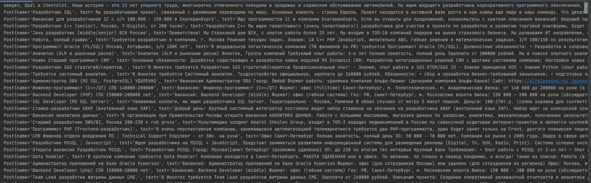

 
Описание прокета. 
Проект представляет собоой парсер вакансий с сайта sql.ru с записью их в базе данных и упорядоченным отображением в консоли.
Реализацияя сделана так, чтобы парсер проверял наличие обновлений через заданный промежуток времени. 
Использованы технологии:  
- java 8;
- postgresql13/jdbc;
- travic;
- jacoco;
- maven;

Вывод в консоль вакансий
